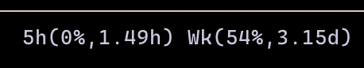

# pi-quota-status

Pi extension that shows quota usage for the active provider in the footer and exposes a command-first JSON interface for scripts.



## What is shipped to npm

The npm package is intentionally small. It ships only what Pi needs to load the extension:

- `src/` production TypeScript files
- `README.md`
- `package.json`
- `assets/screenshots/` for README/gallery images

It does **not** ship repository-only artifacts, local menu-bar helper scripts/icons, or tests. Those live in the repo for development/manual install, but they are not part of the npm runtime package.

## Install

```bash
pi install npm:@mjfuertesf/pi-quota-status
```

From git or a local checkout:

```bash
pi install git:gitlab.com/mjfuertesf/pi-quota-status
pi install ./relative/path/to/pi-quota-status
```

Pi loads the extension from the explicit package manifest entry:

```json
{
  "pi": {
    "extensions": ["./src/extension.ts"]
  }
}
```

No root `index.ts` shim or build step is required.

## Supported providers

| Runtime provider | Footer label | Source |
|---|---|---|
| `openai-codex` | `5h(XX%, Yh) Wk(ZZ%, Wd)` | ChatGPT backend quota API |
| `opencode-go` | `5h(XX%, Yh) Wk(ZZ%, Wd)` | opencode.ai dashboard scrape |
| `claude-bridge` | `5h(XX%, Yh) Wk(ZZ%, Wd)` | Claude web usage API via the Anthropic quota adapter path |
| `anthropic` | `5h(XX%, Yh) Wk(ZZ%, Wd)` | Claude web usage API via the Anthropic quota adapter path |

`claude-bridge` deliberately uses the same Anthropic quota adapter and `quota-status.anthropic-subscription` auth entry as `anthropic`.

Unsupported provider or no active session renders `n/a`. Supported provider with unresolved quota data renders `unknown`.

## Commands

### Usage

```txt
/quota-status-usage
```

Prints the display string, for example:

```txt
5h(82%, 1h30m) Wk(91%, 3.00d)
```

For structured output:

```txt
/quota-status-usage --json
```

Manual smoke test:

```bash
pi --print --no-session --no-context-files --model anthropic/claude-haiku-4-5 "/quota-status-usage --json"
```

`--model <provider>/<model>` determines the active runtime provider seen by the command.

Stable result states:

- `ok`: provider is supported and both quota windows were resolved
- `partial`: provider is supported and at least one quota window was resolved
- `unknown`: provider is supported, but config/auth/network/API data was unusable
- `unsupported`: active provider is not handled by this extension

JSON results include the same display format plus normalized quota fields.

### HAR extraction

```txt
/quota-status-extract <har_filepath>
```

Flags:

- `--write`: save extracted secrets to `~/.pi/agent/auth.json`
- `--no-verify`: skip live credential verification
- `--provider <anthropic-subscription|opencode-go>`: force provider when a HAR is ambiguous

Examples:

```txt
/quota-status-extract @~/Downloads/claude-usage.har
/quota-status-extract --write ~/Downloads/opencode-session.har
/quota-status-extract --write --no-verify @~/Downloads/claude-usage.har
/quota-status-extract --provider opencode-go /path/to/mixed-capture.har
```

Path handling supports `@/path`, `~/path`, and paths with spaces.

## Auth storage

Saved secrets live in `~/.pi/agent/auth.json`.

Claude / Anthropic quota:

```json
{
  "quota-status": {
    "anthropic-subscription": {
      "organizationUuid": "...",
      "authCookie": "...",
      "headers": {
        "anthropic-device-id": "...",
        "user-agent": "..."
      }
    }
  }
}
```

OpenAI Codex quota:

```json
{
  "openai-codex": {
    "access": "<bearer-token>",
    "accountId": "<account-id>"
  }
}
```

opencode-go quota:

```json
{
  "quota-status": {
    "opencode-go": {
      "workspaceId": "...",
      "authCookie": "..."
    }
  }
}
```

HAR files and extracted auth entries contain active session secrets. Treat them like credentials and never commit or share them.

## Development

```bash
npm test
```

The recursive test suite covers command parsing/execution, provider adapters, provider registry, footer refresh behavior, HAR extraction, and script smoke tests.

## Credits

- [BlockLune/pi-chatgpt-usage-status](https://github.com/BlockLune/pi-chatgpt-usage-status) — original compact format and extension skeleton
- [mattleong/pi-better-openai](https://github.com/mattleong/pi-better-openai) — `wham/usage` endpoint discovery and header shape for OpenAI Codex quota reads
- [donrami/pi-go-bars](https://github.com/donrami/pi-go-bars) — opencode-go adapter inspiration
